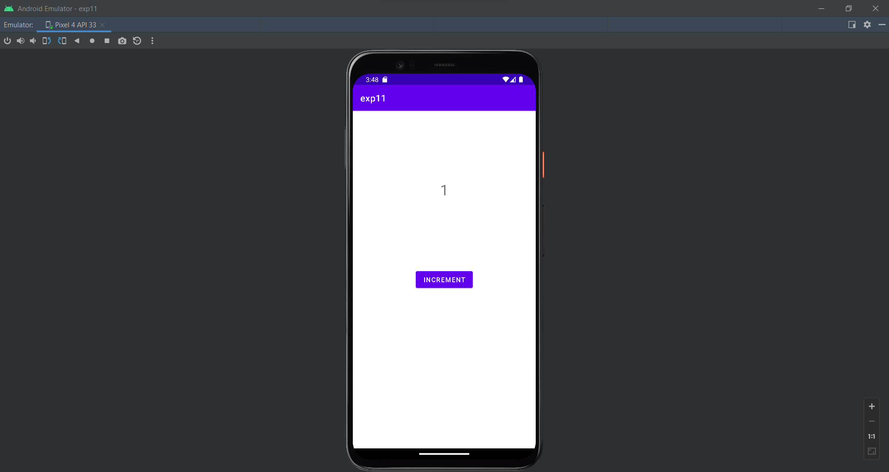
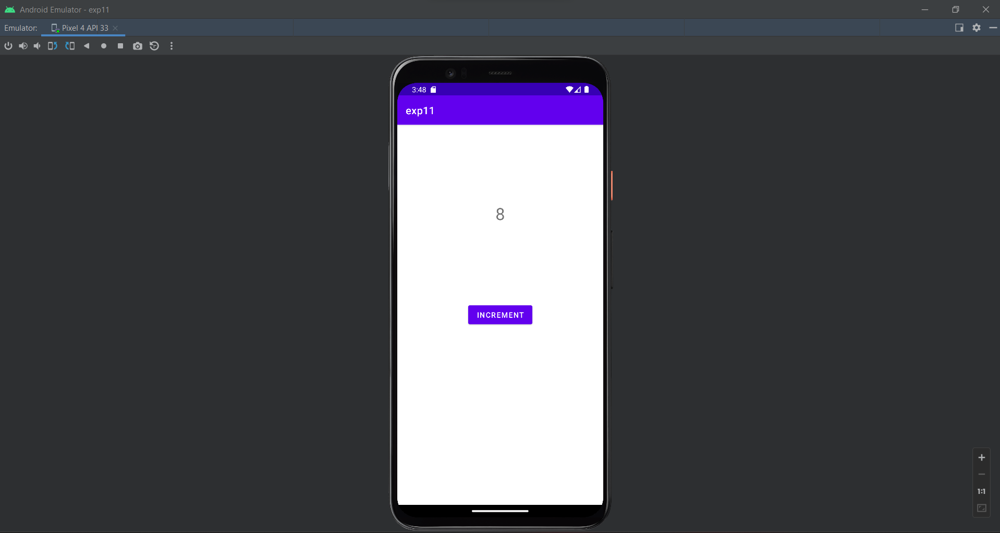
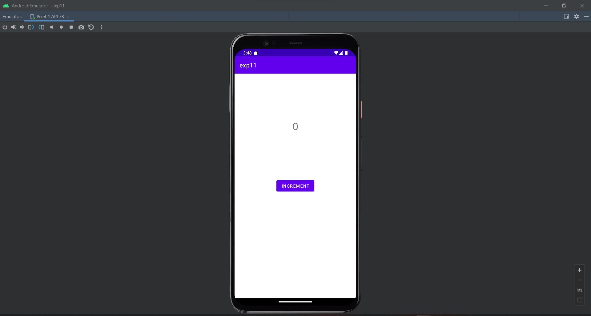

# Ex_No_11_Thread-Synchronization
Develop a program to perform Thread Synchronization using Android Studio
## AIM:
To Develop a program to perform Thread Synchronization using Android Studio.

## EQUIPMENTS REQUIRED:

Android Studio(Min. required Artic Fox)


## ALGORITHM:
Step 1: Open Android Studio and then click on File -> New -> New project.

Step 2: Then type the Application name as SMSIntent and click Next.

Step 3: Select the Minimum SDK below and click Next.

Step 4: Then select the Empty Activity and click Next. Finally, click Finish.

Step 5: Design layout in activity_main.xml.

Step 6: Thread Synchronization processing is done in MainActivity.java

Step 7: Save and run the application.


## Program:
 ```
/*
Program to create an Option Menu
Developed by: MADHAN BABU P
RegisterNumber:  212222230075
*/
```

## MainActivity.java:
```
package com.example.exp11;
import androidx.appcompat.app.AppCompatActivity;
import androidx.appcompat.app.AppCompatActivity;
import android.os.Bundle;
import android.os.Bundle;
import android.os.Handler;
import android.util.Log;
import android.view.View;
import android.widget.TextView;
import androidx.appcompat.app.AppCompatActivity;
import java.util.concurrent.Semaphore;
import android.os.Bundle;
public class MainActivity extends AppCompatActivity {
private static final String TAG = "MainActivity";
// Object used for synchronizing access to counter
private static final Object lock = new Object();
// Maximum number of concurrent threads
// that can access the counter
private static final int MAX_THREADS = 5;
// Semaphore to limit concurrent access to the counter
private static final Semaphore semaphore = new Semaphore(MAX_THREADS);
// Counter to store the
// number of button clicks
private int counter = 0;
// Reference to the text view to
// display the number of button clicks
private TextView textView;
@Override
protected void onCreate(Bundle savedInstanceState) {
super.onCreate(savedInstanceState);
setContentView(R.layout.activity_main);
textView = findViewById(R.id.text_view);
}
public void incrementCounter(View view) {
new Thread(() -> {
try {
semaphore.acquire();
synchronized (lock) {
counter++;
}
activity_main.xml:
} catch (InterruptedException e) {
Log.e(TAG, "Thread interrupted", e);
} finally {
semaphore.release();
}
updateTextView();
}).start();
}
private void updateTextView() {
new Handler(getMainLooper()).post(() -> textView.setText(String.valueOf(counte
}
}
```


## activity_main.xml:
```
<?xml version="1.0" encoding="utf-8"?>
<androidx.constraintlayout.widget.ConstraintLayout
xmlns:android="http://schemas.android.com/apk/res/android"
xmlns:app="http://schemas.android.com/apk/res-auto"
xmlns:tools="http://schemas.android.com/tools"
android:layout_width="match_parent"
android:layout_height="match_parent"
tools:context=".MainActivity">
<!-- A text view to display the count -->
<TextView
android:id="@+id/text_view"
android:layout_width="wrap_content"
android:layout_height="wrap_content"
android:text="0"
android:textSize="32sp"
app:layout_constraintBottom_toTopOf="@+id/increment_button"
app:layout_constraintLeft_toLeftOf="parent"
app:layout_constraintRight_toRightOf="parent"
app:layout_constraintTop_toTopOf="parent" />
<!-- A button to increment the count -->
<Button
android:id="@+id/increment_button"
android:layout_width="wrap_content"
android:layout_height="wrap_content"
android:onClick="incrementCounter"
android:text="Increment"
app:layout_constraintBottom_toBottomOf="parent"
app:layout_constraintLeft_toLeftOf="parent"
app:layout_constraintRight_toRightOf="parent"
app:layout_constraintTop_toTopOf="parent" />
</androidx.constraintlayout.widget.ConstraintLayout>
```

## AndroidMainfest.xml
```
<?xml version="1.0" encoding="utf-8"?>
<manifest xmlns:android="http://schemas.android.com/apk/res/android"
xmlns:tools="http://schemas.android.com/tools"
package="com.example.exp11">
<application
android:allowBackup="true"
android:dataExtractionRules="@xml/data_extraction_rules"
android:fullBackupContent="@xml/backup_rules"
android:icon="@mipmap/ic_launcher"
android:label="@string/app_name"
android:roundIcon="@mipmap/ic_launcher_round"
android:supportsRtl="true"
android:theme="@style/Theme.Exp11"
tools:targetApi="31">
<activity
android:name=".MainActivity"
android:exported="true">
<intent-filter>
<action android:name="android.intent.action.MAIN" />
<category android:name="android.intent.category.LAUNCHER" />
</intent-filter>
</activity>
</application>
</manifest>
```
## Output





## Result:
Thus a Simple Android Application to create an Thread synchronization using Android Studio was developed and executed successfully.
